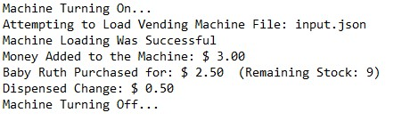

Vending Machine
=================
This is a command line Java implementation of a vending machine using an MVC approach.

The machine is loaded from a JSON input file. The user is then greeted by a welcome message
and given various options to interact with the machine. The machine also logs all major events 
during transaction and loading states.

Requirements to run the program:
--------------------------------
<ul>
<li>Java 17.0.2</li>
<li>Maven 3.8.4</li>
</ul>

Instructions to run the program:
--------------------------------

1. Clone the repo by typing the following command in your terminal:
```
git clone git@github.com:Jiminger/JavaVendingMachine.git
```

2. Run the program by navigating in to the cloned JavaVendingMachine folder and entering the following command in the terminal:
```
mvn clean compile exec:java
```

Input file constraints:
-------------------------------
1. The file must be in the same format as the original input file.
2. **The amount of rows specified by the input file can not exceed 26.**


Screenshots
-------------------------------
<p align="center">
```Welcome Message```


```Menu```


```Accepting Money```


```Item Select / Dispensing Item / Dispensing Change```


```Audit File```


  
  </p>
